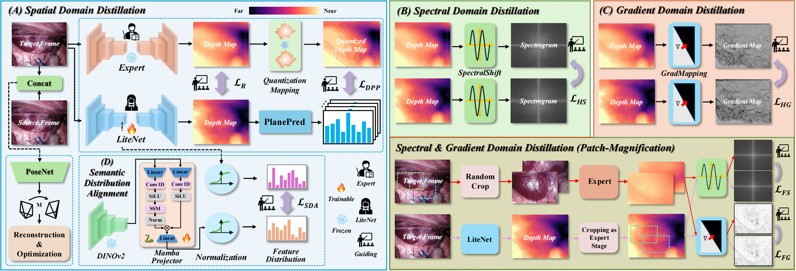

# Beyond Foundation Models: Distilling Geometric Priors for Lightweight Monocular Depth Estimation in Endoscopy
IEEE Transactions on Medical Imaging, 2026


## Overview

<p align="center">
  
</p>


## Environment

Please create the environment using:

```bash
conda env create -f environment.yml
conda activate *
```


## Evaluation
```bash
python evaluate_depth.py --data_path ./your_data --load_weights_folder ./your_weight --eval_mono
```

## Pre-trained Weights

The pretrained model weights are available at:

**Download link:**  
[Google Drive](https://drive.google.com/drive/folders/15igg2C0qVi4Eim7pJJmFJFQTsuidxIyU?usp=drive_link)


## Citation
If you find this work useful, please consider citing:
```bash
@article{zhu2026beyond,
  title={Beyond Foundation Models: Distilling Geometric Priors for Lightweight Monocular Depth Estimation in Endoscopy},
  author={Zhu, Kejin and Shao, Shuwei and Yang, Yongming and Tian, Zhongyu and Zhang, Baochang and Min, Zhe},
  journal={IEEE Transactions on Medical Imaging},
  year={2026},
  publisher={IEEE}
}
```
